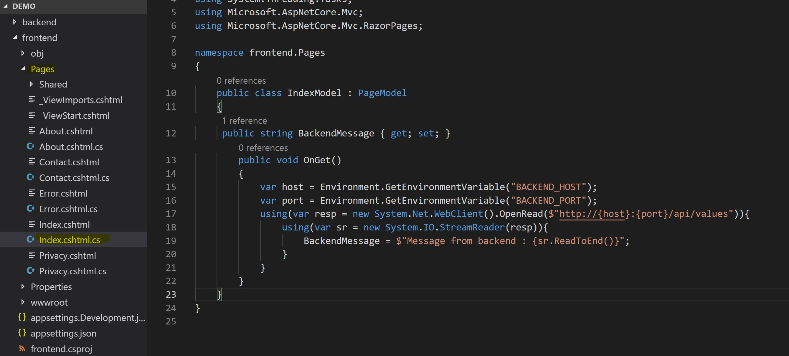
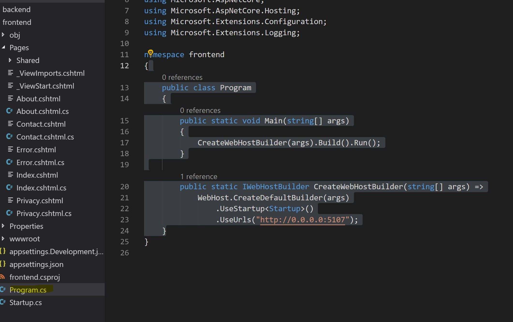
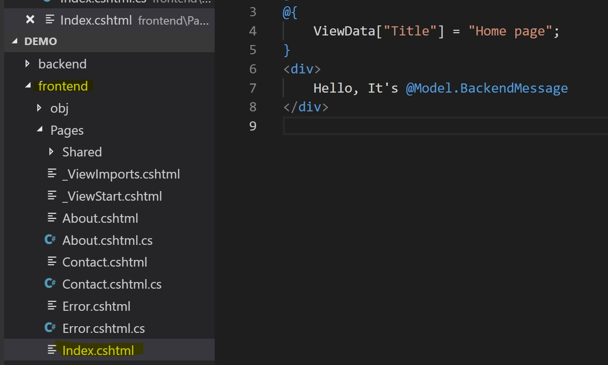
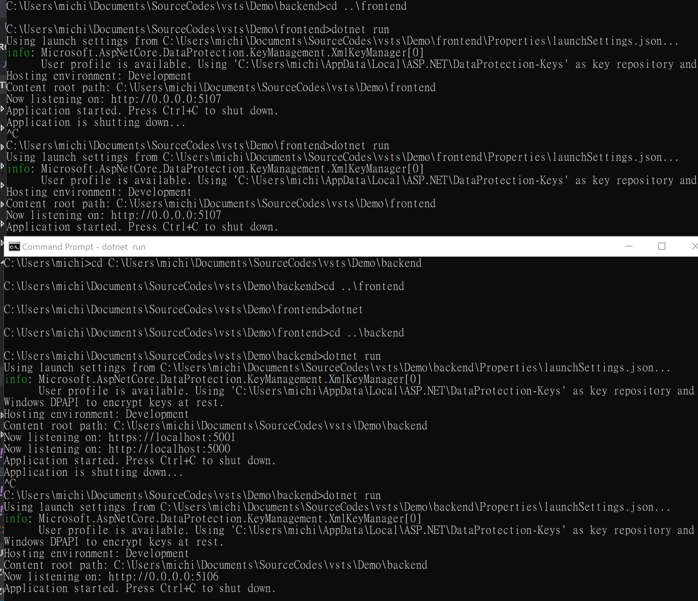
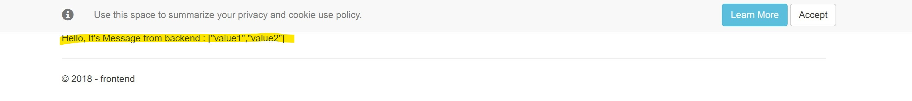
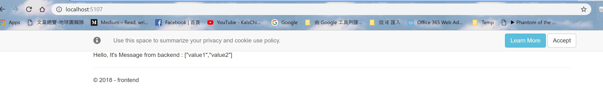

Deploying a simple 2-tier hello world application
==========================================
Now we have our kubernetes cluster setup, we want to deploy something to it just verify if it works. As well as to have a got feeling on how to deploy an application.

Since I am not trying to understand how to develop a k8s application at the moment. I decided to use a very basic dotcore web application that talks to a backend REST API here just to experience deployment process.

<h2>Setup development environment</h2>

- On my Windows 10 machine, I have .Net Core SDK 2.1 installed already. If you do not have it on your machine, download and install preferred .Net core SDK <a href="https://dotnet.microsoft.com/download/archives">here</a>
- Once installed, open up command prompt, execute below commands to see what project templates we have
```
dotnet new --help
```
You'll see a list of supported ASP.Net core project templates
```
Templates                                         Short Name         Language          Tags
-------------------------------------------------------------------------------------------------------------------------------------
DurableFunctionsOrchestration                     durable            [C#]              Azure Function/Durable Functions Orchestration
SendGrid                                          sendgrid           [C#]              Azure Function/Ouput/SendGrid
BlobTrigger                                       blob               [C#]              Azure Function/Trigger/Blob
CosmosDBTrigger                                   cosmos             [C#]              Azure Function/Trigger/Cosmos DB
EventGridTrigger                                  eventgrid          [C#]              Azure Function/Trigger/EventGrid
...
```
-   I need to create two applications - a frontend Web site and a backend REST API. So I starte with a ASP.Net Razor Web frontend project
```
mkdir frontend
cd frontend
dotnet new razor
```
-   To create a REST API project template
```
cd ..
mkdir backend
cd backend
dotnet new webapi
```
-   These will generate two projects. A web site and a REST API. Now I want to made some changes to my codes to have frontend Web UI talk to backend API

<h2>FrontEnd application</h2>

-   Now, I want my website showing something came from my backend API. Easiest way to do this is to update my IndexModel.

-   The Backend project template already has a dummy REST API defined, we can access it via localhost/api/values. Since what I really care are how to make frontend talk to the backend, I am using what it gives me at the moment without changing it.

-   On the other hand, my frontend application eventually will be deployed as a container, so my frontend retrieve backend endpoint from environment variable. Here I am not yet think of how Kubernetes does this (It surely does it, right ?). So go to frontend application, go to Pages\Index.cshtml.cs, make some changes.


```csharp
namespace frontend.Pages
{
    public class IndexModel : PageModel
    {
        public string BackendMessage { get; set; }
        public void OnGet()
        {
            var host = Environment.GetEnvironmentVariable("BACKEND_HOST");
            var port = Environment.GetEnvironmentVariable("BACKEND_PORT");
            using(var resp = new System.Net.WebClient().OpenRead($"http://{host}:{port}/api/values")){
                using(var sr = new System.IO.StreamReader(resp)){
                    BackendMessage = $"Message from backend : {sr.ReadToEnd()}";
                }
            }
        }
    }
}
```


- I also want to change listening port. Go to frontend\Program.cs. I make my frontend listen to port 5107 from any coming IP address.

```csharp
namespace frontend
{
    public class Program
    {
        public static void Main(string[] args)
        {
            
            CreateWebHostBuilder(args).Build().Run();
        }

        public static IWebHostBuilder CreateWebHostBuilder(string[] args) =>
            WebHost.CreateDefaultBuilder(args)
                .UseStartup<Startup>()
                .UseUrls("http://0.0.0.0:5107");
    }
}

```



- Now I want to show whatever I got from my backend to frontend page. To do this, go to Index.cshtml. Change codes as below

```csharp
@page
@model IndexModel
@{
    ViewData["Title"] = "Home page";
}
<div>
    Hello, It's @Model.BackendMessage
</div>

```



<h2>Baclend Application</h2>

- Change backend application make it listening to 5106 port
```csharp
namespace backend
{
    public class Program
    {
        public static void Main(string[] args)
        {
            CreateWebHostBuilder(args).Build().Run();
        }

        public static IWebHostBuilder CreateWebHostBuilder(string[] args) =>
            WebHost.CreateDefaultBuilder(args)
                .UseUrls("http://0.0.0.0:5106")
                .UseStartup<Startup>();
    }
}
```

<h2>Test Locally</h2>
So now I have a frontend and a backend, it's time to see how they work together.

- First, open up command prompt and set up environment variables. Execute below commands
```
set BACKEND_HOST=localhost
set BACKEND_PORT=5106
```

- Execute below command to run web frontend
```
cd frontend
dotnet run
```

- Open another command prompt, execute below command
```
cd backend
dotnet run
```
- You should see output similar to this



- Open a browser to verify



Yeah, our fancy web application actually runs !

Containerize
===============

Alghouth we can run linux container on Windwos machine now. It sometimes conflicts with certain Windows versions. So to make thing simple, I have a Ubuntu 16.0.4 virtual machine on Azure for me to create and verity my containerized applications.

- If you haven't install docker yet. Follow [official instruction](https://docs.docker.com/install/linux/docker-ce/ubuntu/) to install and configure Docker in your Ubuntu machine

- Copy everything we just created to the machine (We will make this better later)

- Now we need two Dockerfile, each creates an image for our applications

<h2>Create Dockerfile for applications</h2>

- Create a new file named "Dockerfile" under frontend folder

- Input below content and save.
  - First we start a docker image from microsoft/dotnet:2.1-sdk image

  - Then we copy everything in our project folder to destination's /app folder (inside the container)

  - And do dotnet restore to restore dependencies
  
  - Do dotnet publish to publish binaries

  - Then we copy our output binary to /app folder

  - When the container image gets launch, execute "dotnet frontend.dll" command to launch our web application

```docker
FROM microsoft/dotnet:2.1-sdk AS build
WORKDIR /app

COPY . .
WORKDIR /app/frontend
RUN dotnet restore

RUN dotnet publish -c Release -o out

FROM microsoft/dotnet:2.1-aspnetcore-runtime AS runtime
WORKDIR /app
COPY --from=build /app/frontend/out ./

ENTRYPOINT ["dotnet", "frontend.dll"]
```

  - Similarly, start a new Dockerfile under backend folder

```docker
FROM microsoft/dotnet:2.1-sdk AS build
WORKDIR /app

COPY . .
WORKDIR /app/backend
RUN dotnet restore

RUN dotnet publish -c Release -o out

FROM microsoft/dotnet:2.1-aspnetcore-runtime AS runtime
WORKDIR /app
COPY --from=build /app/backend/out ./

ENTRYPOINT ["dotnet", "backend.dll"]
```

  -   In order to verify, we created a docker-compose.yml.

```yaml
version: '3'
services:
  backend:
    build: ./backend
    ports:
      - "5106:5106"
  frontend:
    build: ./frontend
    environment:
      - BACKEND_HOST=backend
      - BACKEND_PORT=5106
    ports:
      - "5107:5107"
    depends_on:
      - backend

```
  -   To run the application, execute below command in the folder which contains docker-compose.yml


```shell
docker-compose up
```

  -   Launch a browser and navigate to http://localhost:5107, you should see below result


