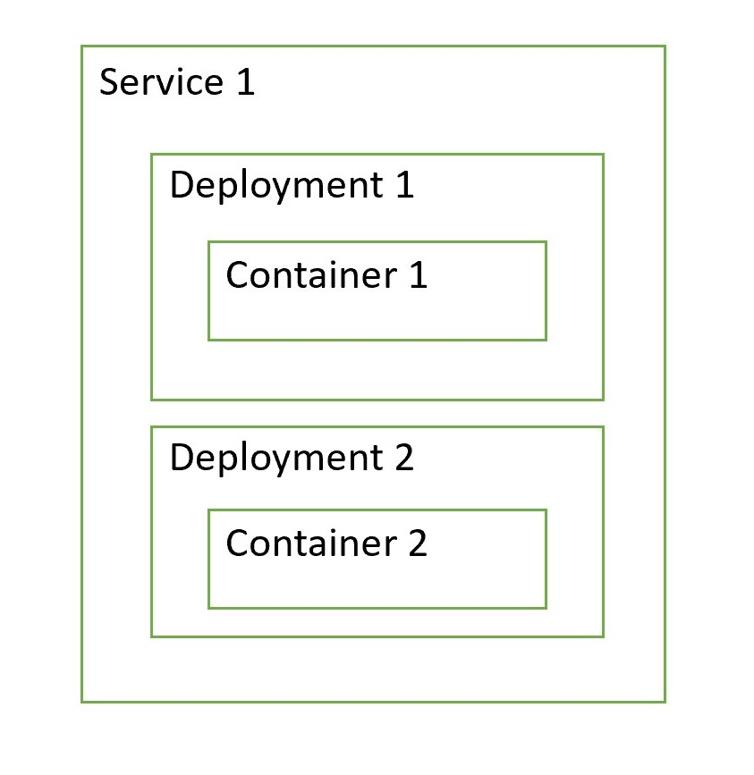
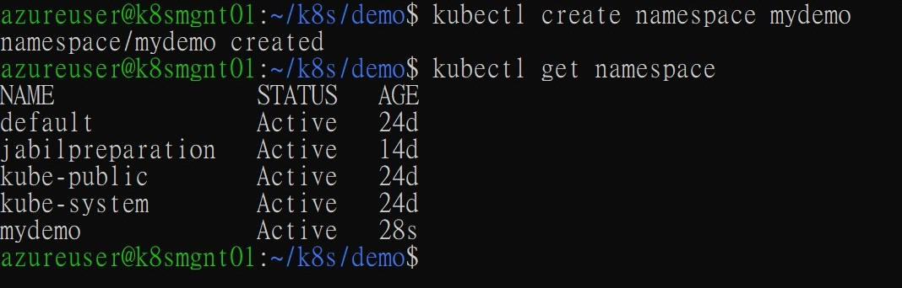
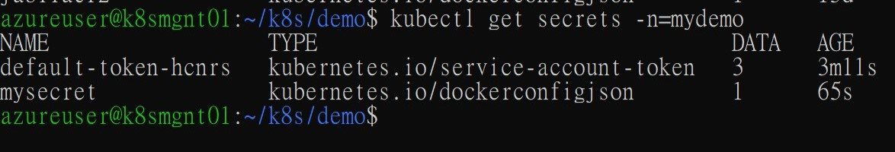
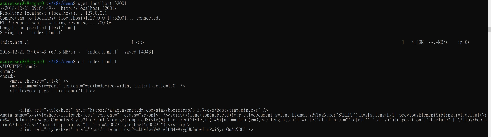

Create a Build pipeline
=======================

Next step I want to create a build pipeline to automatically build my application into Kubernetes applications. In order to do so, I need:

-   Understand how applications running on a k8s cluster
-   An Azure DevOps subscription
-   A Build pipeline that triggered by code commits

How applications running on a kubernets cluster
===============================================
[Kubernetes official website](https://kubernetes.io/docs/concepts/services-networking/service/)  actually provides very detailed information on how it manages applications. As that is not what I want to address here. 

In a high-level view, I need to create two deployments for my backend and frontend application. Then I need to create two services for each deployments.

A deployment is a minimal deplpyment unit, it can container one or more applications in it. These applications are considered a basic unit to deploy to k8s cluster, and should have same life cycle.

A service is an abstraction which defines a logical set of Pods and a policy by which to access them. It also provides a virtual loadbalancer that accepts incoming traffic from outside of services

A High level chart may look like this



In order to have my frontend and backend running on kubernetes cluster, I need to create two deployment files, and two services file.

-   Create a Kubernetes namespace

-   Create a Kubernetes secret

-   Frontend deployment defination

Create Kubernets Namespaces and Secrets
=======================================
Now, before actually create a build and release pipeline to deploy our applications to kubernetes. I'd like to first manually deploy to understand what are required steps.

As mentioned, we want to store credentials or secrets somewhere safe. Here I am using Kubernetes secret to store my Azure Container Registry credential. In addition, to isolate my different applications, I will be creating a namespace for each application.

- To Create a namespace, execute below command

```shell
kubectl create namespace <NAMESPACE>
```



- To create Kubernets secret, ssh into your k8s node or where you have kubectl tool installed. 

```shell
kubectl create secret docker-registry <SECRET NAME> --docker-server <ACR NAME>.azurecr.io --docker-email michi@microsoft.com --docker-username=<USER NAME> --docker-password <PASSOWRD> -n=mydemo

```



Create Deployment and Service Defination
========================================

To deploy application to kubernets, you first specify deployments, then define services that use deployments as underlying service providers.

- Deployment defination

```yaml
apiVersion: apps/v1
#   specify defination kind, which in this case is a Deployment
kind: Deployment
metadata:
#   This name will be use later for our service to pick corresponding deployment
  name: twotier-backend
#   To isolate our application with other application, we create a namespace as isolation layer. This namespace value can be pass in later in our pipeline - which is a better practice
#  namespace: myapp01
spec:
#   Here we specify how we want to "search" for our docker image
  selector:
    matchLabels:
      app: twotier-backend
      tier: backend
      track: stable
# How many replicas
  replicas: 1
  template:
    metadata:
#      namespace: myapp01
      labels:
        app: twotier-backend
        tier: backend
        track: stable
    spec:
      containers:
#   Above selector will search for names that matches this name
        - name: twotier-backend
#   My docker image tag
          image: myazureacr001.azurecr.io/backend-app:latest
#   My container wants to export port 5106 for external commnunication
          ports:
            - name: http
              containerPort: 5106
      imagePullSecrets:
#   Here we pull our Container Registry credentail from kubernets secret we created in above step
        - name: mydemo
```

-   Frontend Service defination file

It's easier than deployment defination file, in a service defination, we just tell kubernetes that which deployment we want to use as its underlying service provider. Here we specify selector under spec to have kubernets search for any deployments that has app metadata matches "twotier-backend" and tier matches "backend"

Now one thing worth notice is the "type" field. In kubernets, you specify service type by giving it one of below values:
    
    - NodePort
    Expose the service's specified ports to host node's Cluster IP address. A Cluster IP is a virtual IP address that a node gets assigned by software network.  

    - ClusterIP (Default)
    Expose the service on a internal cluster IP address, makes this service accessible only from within kubernetes cluster.

    - LoadBalancer
    Expose the serviec to external using a cloud provider's load balancer mechanism

    - ExternalName
    Maps the service to the content of the external name field.

I am using NodePort here, other type I've successfully tested in my Azure environment so far are ClusterIP.

Below is my service defination file. We can combine deployment and service defination into one single yaml file by separating them with '---'

- Service Defination

```yaml
kind: Service
apiVersion: v1
metadata:
  name: app-backend
  namespace: jabilpreparation
spec:
  selector:
    app: twotier-backend
    tier: backend
  ports:
  - protocol: TCP
  # Expose 5106 to Cluster IP (Virtual or Physical IP)
    port: 5106
  # Target Deployment's 5106 port
    targetPort: 5106
  # Expose 5106 port to Physical Node Host
    nodePort: 5106
  type: NodePort
```

- Create deployment and service defination for frontend service.
  - <a href="references/k8s/backend.yml">Sample backend defination</a>
  - <a href="references/k8s/frontend.yml">Sample frontend defination</a>

Manually Deploy applications to Kubernetes cluster
==================================================

- To manually deploy our services to kubernetes cluster, simply run 

```shell
kubectl apply -f <YAML FILE> -n <NAMESAPCE>
```

- Verify frontend and backend.

