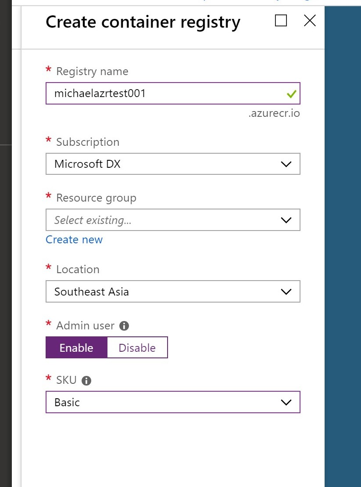
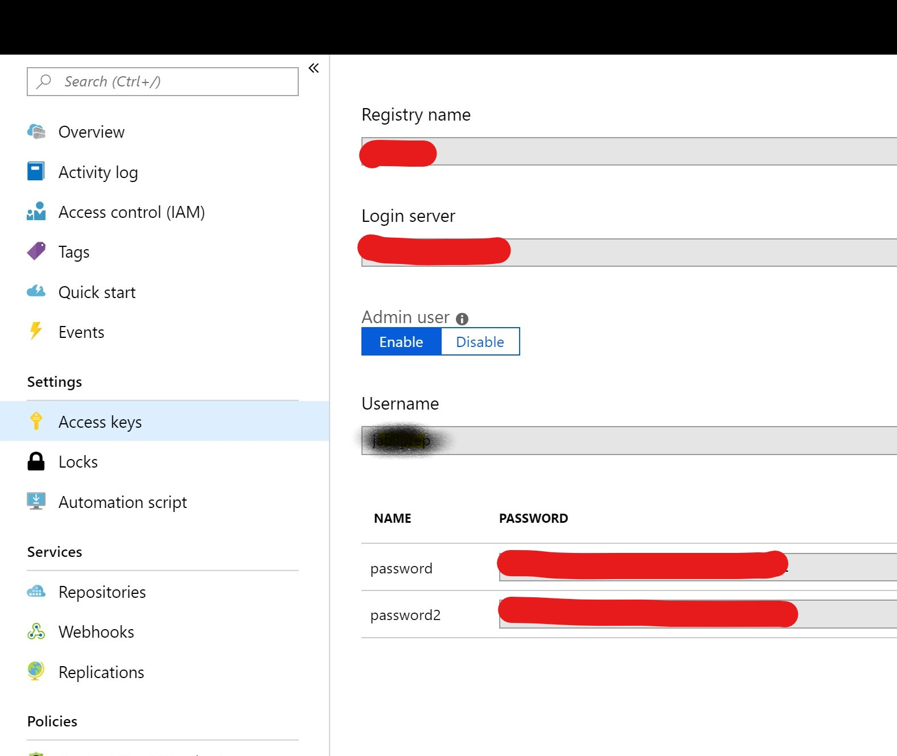
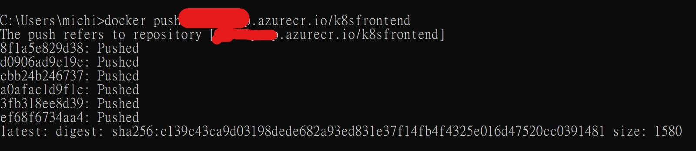
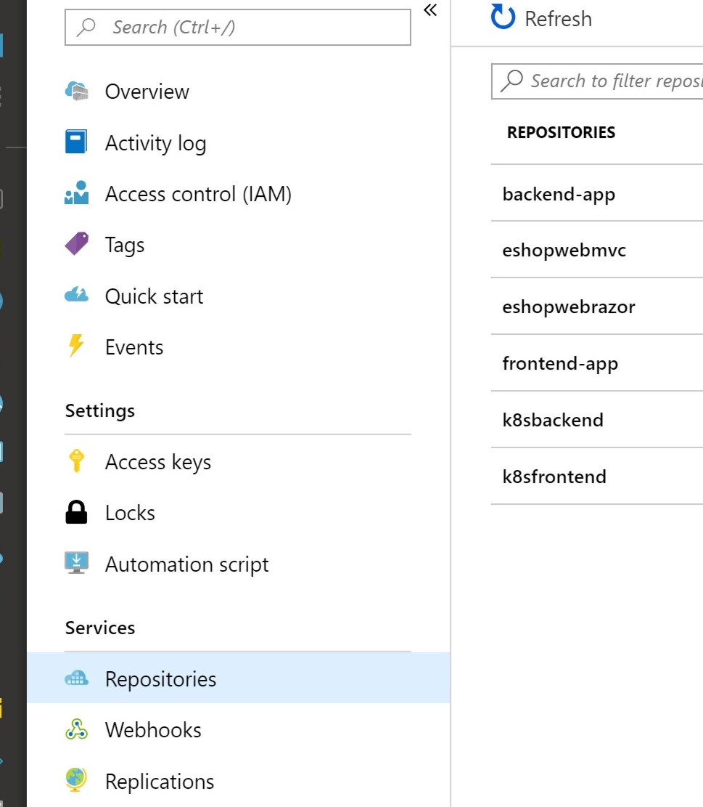

Build Azure Container Registry
==============================
Now that I have my sample docker container application running and have them talk to each other. Next, I'd like to setup environment to do CI/CD. Here I will be using Azure DevOps as my CI/CD tool, and use Azure Container Registry to simulate using a private container registry to store my docker images.

It's very simple to setup an Azure Container Registry

- Go to Azure Portal, create a new Azure Container Registry as you create other Azure services

  -   Note that if you disable "Admin User", you would need to create a service principal in Azure AD so that later you use that service principal credential to login to Azure Container Registry.

        If you enable "Admin User" here, you can use Azure created user Id and password to login to ACR later. This is NOT recommand in production environment, but for our development we choose to enable it to simplify necessary steps



-   Once complete creation, goto Azure Container Registry console, Access Keys. You can find Username and Password here, which we can use later to login to Azure Container Registry.
-   You can also find Login Server URL here, note down the url, we will need it later.



Push docker images to Azure Containr Registry
=============================================

- Now we have our ACR up and running, I want to push my newly created docker images to my Azure Container Registry. Execute below command to login to my ACR
  - User Name, Password and Login Server URI are retrieved from ACR console shown above
  - 

```shell
docker login -p <PWD> -u <USER> myacrdemo001.azureacr.io
```

- Then we push our images to ACR

```shell
docker tag kalschi/frontend <ACRNAME>.azurecr.io/<IMAGE NAME>

docker push <ACRNAME>.azurecr.io/<IMAGE NAME>
```



- Push both frontend and backend to ACR.

