Create a release pipeline
=========================

In previous step we created a build pipeline which automatate build process whenever we commit our codes. Next step is to create a release pipeline to automatic deploy our applications to Kubernetes cluster.

-   Create a new Azure Release Pipeline

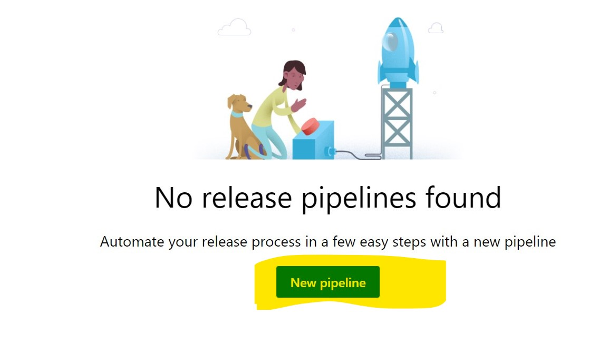

-   Start from an empty template

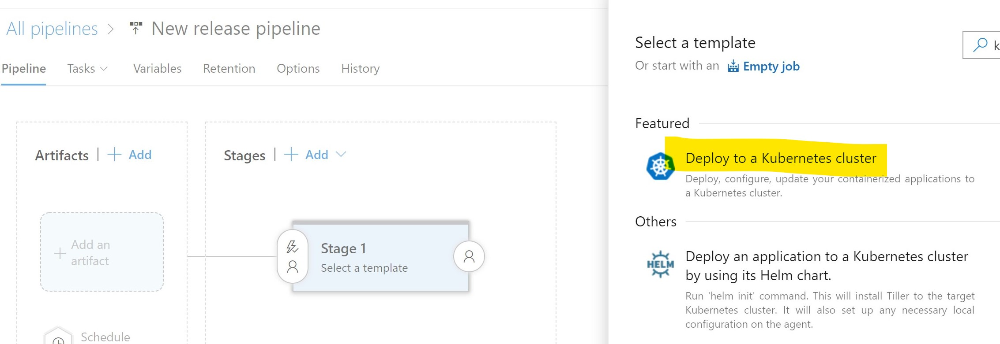

-   Once created, select our build source

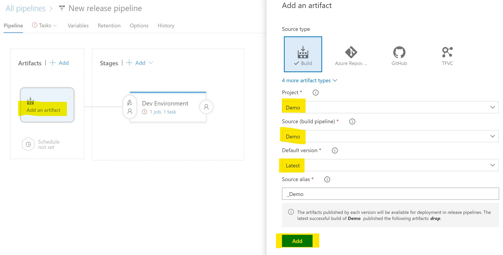

-   Once selected, add a new task

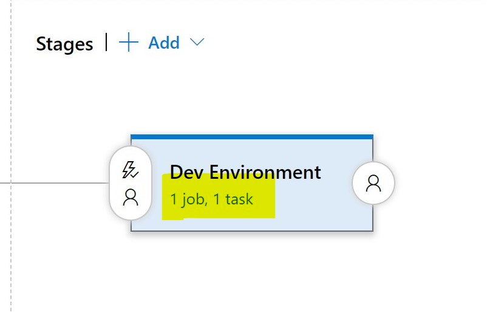

-   Select agent pool, here we use Ubuntu

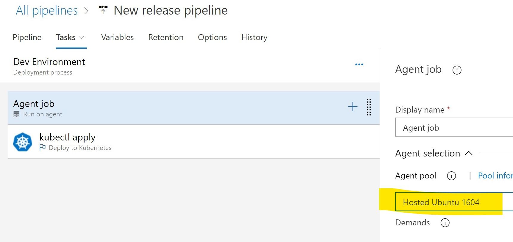

-   Next, we want to deploy our backend application. We run kubectl apply command against our service defination file to deploy application.

    In order to have our pipelin task able to connect to our Kubernetes cluster, we need to create and specify a Service Connection here.

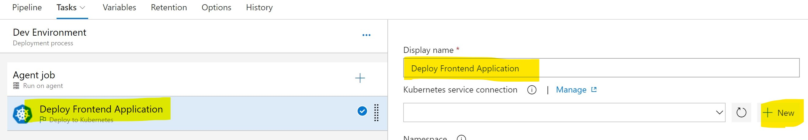

-   You will be prompt to input Kubernets connection information. In my lab environment I am using kubeconfig, if you configured Service Accoubt while creating kubernets cluster you can use it.

    -   Give this connection an user friendly name

    -   Kubeconfig file locates in your $HOME/.kube/config. Copy its content and paste into "KubeConfig" field


```shell
sudo cat $HOME/.kube/config
```

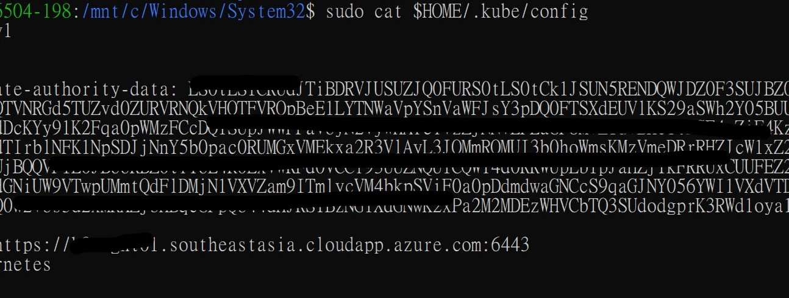

    -   Select Cluster Context after you paste KubeConfig

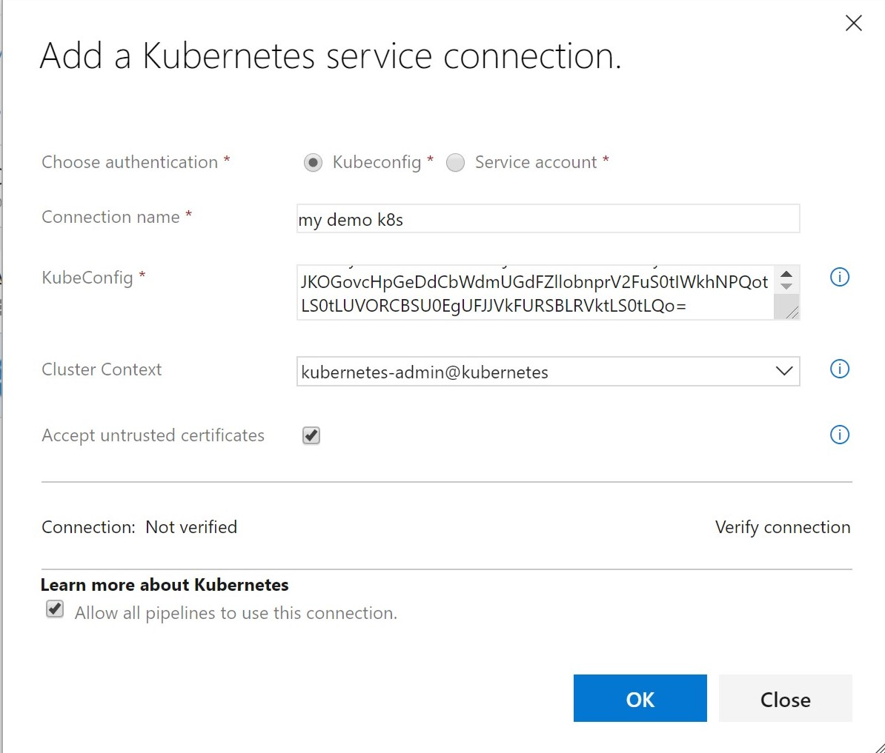

-   Check "Accept untrusted certificates", Verify connection then Click OK to close dialog.

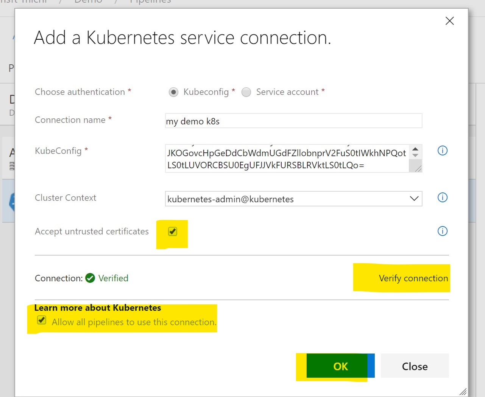

-   Next, make sure we selected correct connection and then specify correct namespace that we created and will be using to isolate our applications.

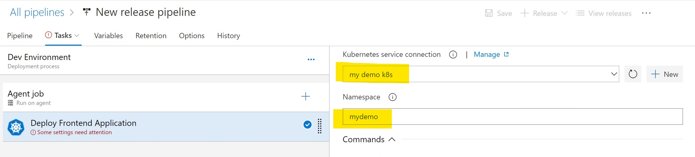

-   We use kubectl apply to deploy our applications. Check "Use Configuration files"

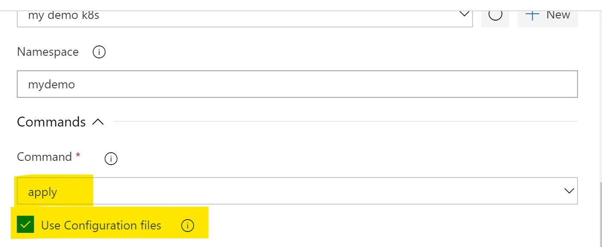

-   Select our kubernetes defination file.

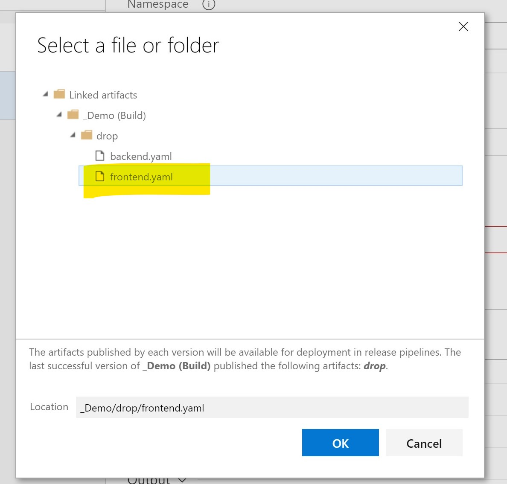

-   Add below argument as we are using self-signed certificates

```shell
--insecure-skip-tls-verify=true
```

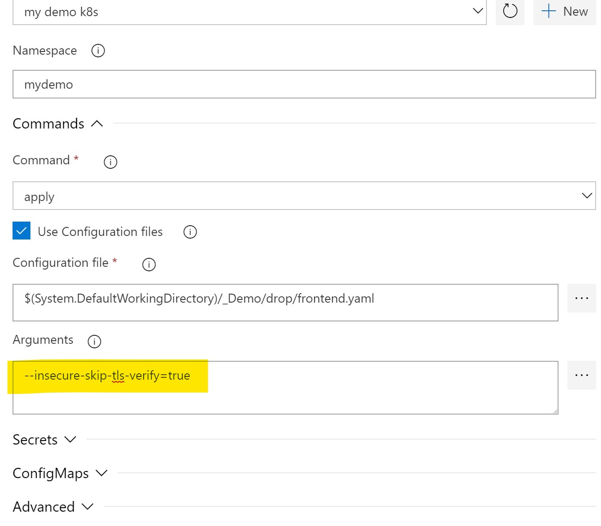

-   Clone this task, we want to deploy our backend application

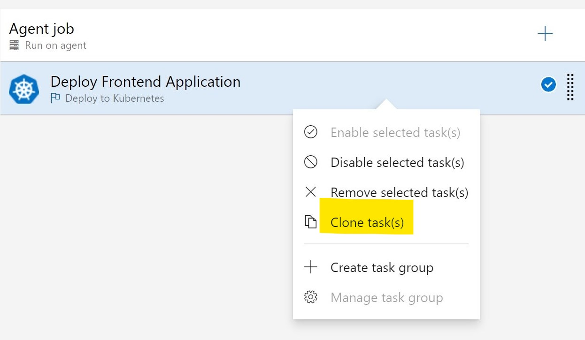

-   Update cloned task to reference backend.yaml. And move backend task to first task. Then Save this Pipeline.

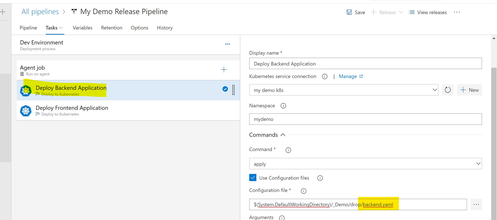

-   Start a new release, wait and verify the deployment.

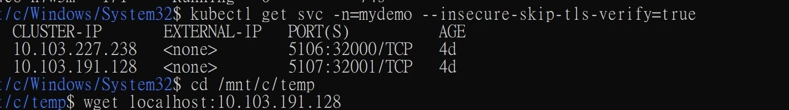