Automatically Build and Release
==================================
In previous step, I learned how to deploy applications to kubernets cluster manually. Now I want to automatate build and deployment process using Azure Pipelines.

Azure Pipelines provides a GUI for developers to create a build pipeline. It also provides capability to wirte a yaml file that streamline build process.

I will be using yaml file to craete my build pipeline in this document.

Reference
=========
-   [Build, test, and push Docker container apps in Azure Pipelines](https://docs.microsoft.com/en-us/azure/devops/pipelines/languages/docker?view=vsts&tabs=yaml)

-   [Source code](../src/)

Create a Build Pipeline
=======================

-   It's more like programming if using yaml defination. We want to convert what we do manually to scripts. Here's what we need

    -   An environment to run our scripts

    -   Download source codes from source control

    -   Login to our container registry

    -   Build our application to docker image

    -   Push to container registry


-   Add deployment and service defiantion file we created previously to source control under k8s folder

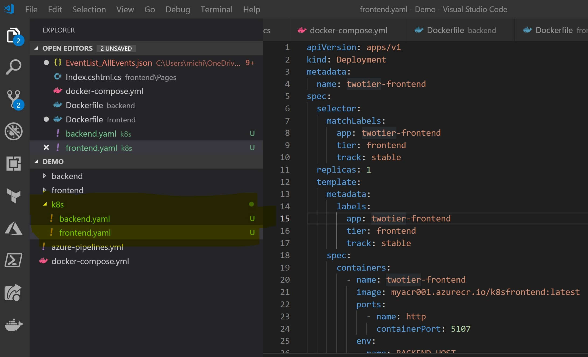

-   Create a new build pipeline

    In Azure Pipelines, create a new build pipeline

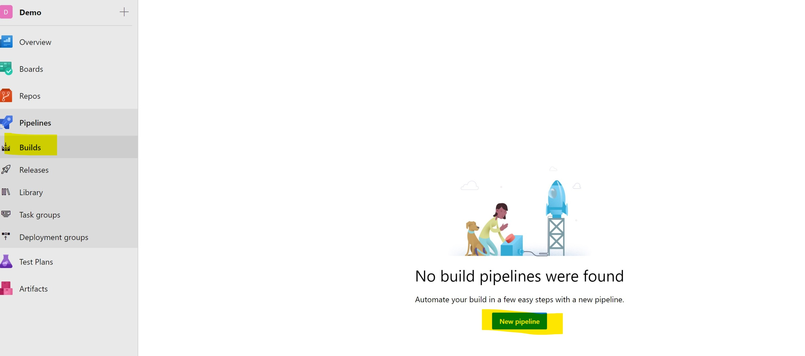

-   Choose Azure Repos as source code location. If you are using github choose Github.

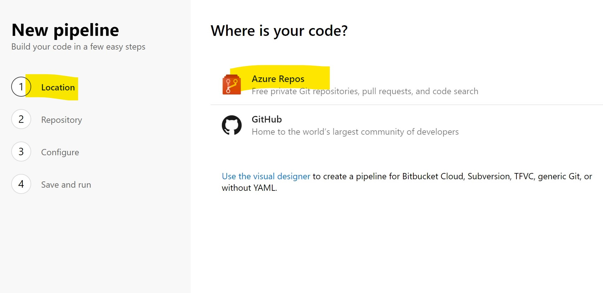

-   Choose project

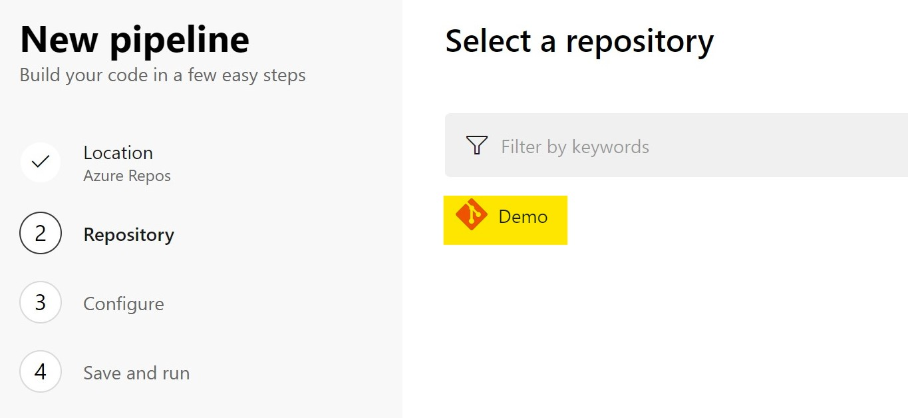

-   Choose Docker template. This will create a new file called "azure-pipeline.yaml" in your source repository.

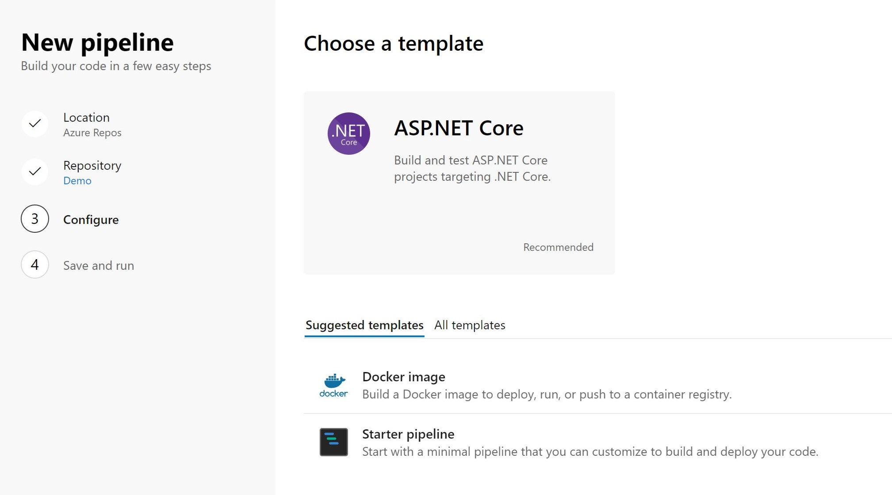

-   We use below to kick-off automatic build whenever codes commit and push to Azure Repo. If you prefer manual kick-off, remove below script.

```yaml
#   The pipeline kick-off whenever codes are push to master branch
trigger:
- master
```

-   Prepare an environment to run our srcipts

    -   Azure Pipelines provides verious prebuilt machines as build environment and managed as a pool. In our defination file we use below script to request a Ubuntu 16.04 machine for our tasks.

```yaml
pool:
  vmImage: 'Ubuntu 16.04'   # other options: 'macOS-10.13', 'vs2017-win2016'
```

-   We can define variables in our pipeline with following scripts when required.


```yaml
variables:
  frontendImageName: 'myacr001.azurecr.io/k8sfrontend:$(build.buildId)'
  backendImageName: 'myacr001.azurecr.io/k8sbackend:$(build.buildId)'
```

-   Now, let's build our application container images.

    -   Note that since we are build our container image in a machine, when download source codes from Azure Repos to the pool agent machine, our codes are under "backend" or "frontend"folders. So we need to change our Dockerfile to reflect the change.

```docker
#   COPY . .
COPY ./frontend .
```

And backend application


```docker
#   COPY . .
COPY ./backend .
```

-   Next we want to build our applications.

```yaml
steps:
- script: docker build -f ./backend/Dockerfile -t $(backendImageName) .
  displayName: 'build backend container'
- script: docker build -f ./frontend/Dockerfile -t $(frontendImageName) .
  displayName: 'build frontend container'
```

-   Login to Azure Container Registry and push our images to ACR

    -   Here I hardcode my ACR user name and password in yaml file. I will improve that later. But for now I just want to see it works.


```yaml
- script: docker login <ACRNAME>.azurecr.io -u jabilprep -p <YOUR ACR PASSWORD>
  displayName: 'docker login'
- script: docker push $(backendImageName)
  displayName: 'push backend container'
- script: docker push $(backendImageName)
  displayName: 'push frontend container'
- task: PublishBuildArtifacts@1
  inputs:
    pathtoPublish: './k8s'
    artifactName: drop
```

-   Once finished, your yaml file should look like this.

```yaml
pool:
  vmImage: 'Ubuntu 16.04'   # other options: 'macOS-10.13', 'vs2017-win2016'

variables:
  frontendImageName: 'jabilprep.azurecr.io/k8s-demo-frontend-app'
  backendImageName: 'jabilprep.azurecr.io/k8s-demo-backend-app'

steps:
- script: docker build -f ./backend/Dockerfile -t $(backendImageName) .
  displayName: 'build backend container'
- script: docker build -f ./frontend/Dockerfile -t $(frontendImageName) .
  displayName: 'build frontend container'
- script: docker login <ACRNAME>.azurecr.io -u <ACR USERNAME> -p <ACR PASSWORD>
  displayName: 'docker login'
- script: docker push $(backendImageName)
  displayName: 'push backend container'
- script: docker push $(frontendImageName)
  displayName: 'push frontend container'
- task: PublishBuildArtifacts@1
  inputs:
    pathtoPublish: './k8s'
    artifactName: drop
```

-   Save and queue a new build. Once successfully built, you should see two new container images been pushed to our Azure Container Registry

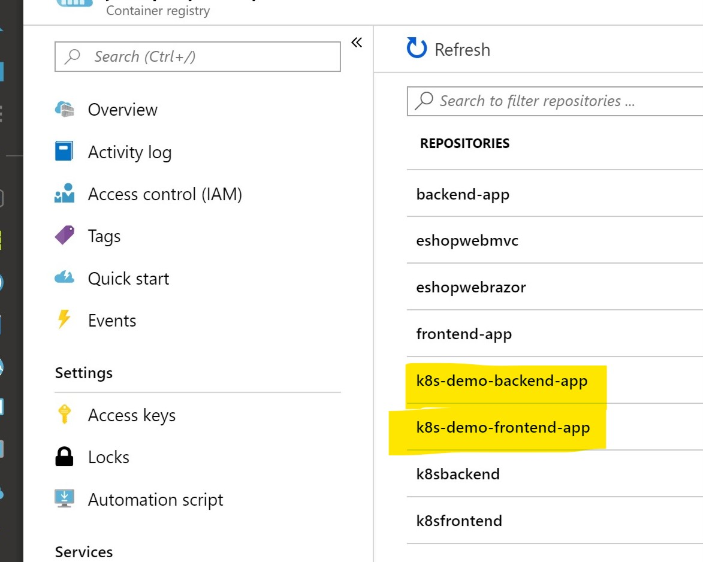

Make credential secret
======================

In previous step, I hardcoded user name and password for my Azure Container Registry in my yaml file. In real scenario we want to keep those credentails private. To do this, We define a "secret" in Azure Pipelines.

-   Edit our pipeline

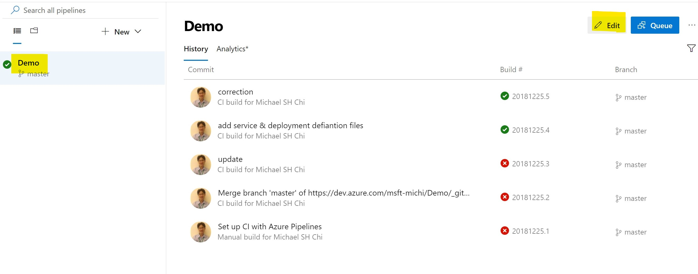

-   Switch to visual designer mode

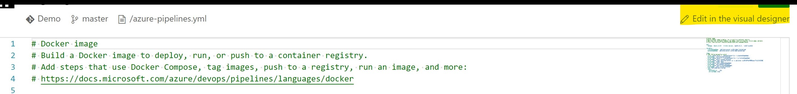

-   Add a new pipeline variable

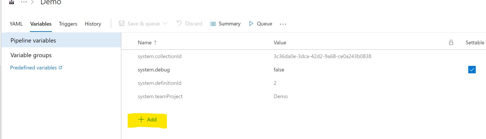

-   Change its type to "Secret"

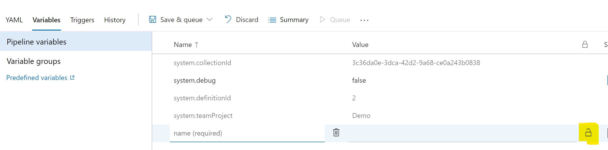

-   Add ACR password secret and Save

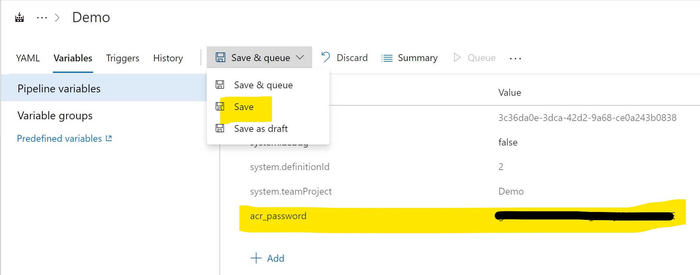

-   Change our azure-pipeline.yaml.

```yaml
#   - script: docker login <ACRNAME>.azurecr.io -u <ACR USERNAME> -p <ACR PASSWORD>
#     displayName: 'docker login'
- script: docker login jabilprep.azurecr.io -u jabilprep -p $(acr_password)
  displayName: 'docker login'
```

-   Commit and kickoff a new build

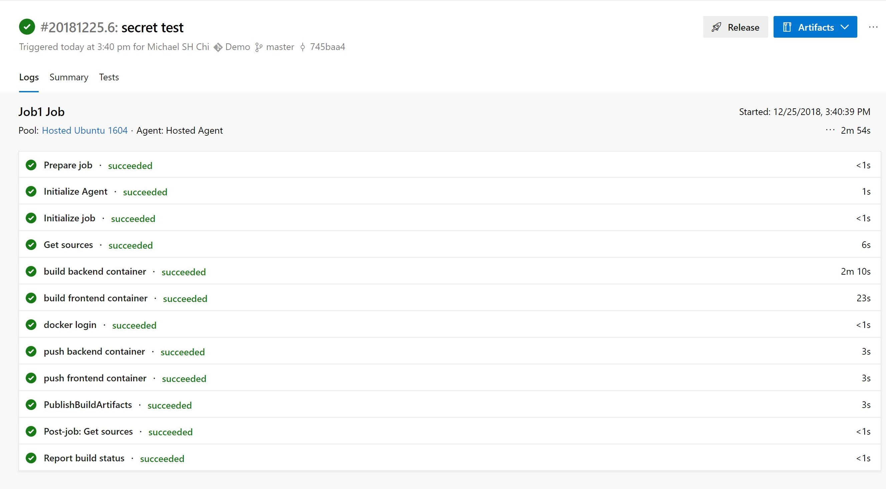

-   You can create other pipeline variables for other parameters in yaml file so that those parameters can be changed at runtime instead of in source codes.